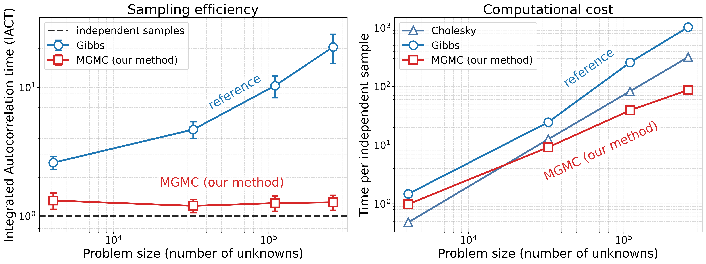

[](https://github.com/eikehmueller/MultigridMC/actions/workflows/automated_testing.yml)
[](https://github.com/psf/black)

# Multigrid Monte Carlo
Implementation of the **Multigrid Monte Carlo (MGMC)** algorithm by Goodman and Sokal, a computational technique for sampling from complex probability distributions that arise in high‑dimensional spatial statistics. The code provides a C++ implementation of MGMC alongside alternative classical sampling strategies, supporting experimentation with efficient posterior inference in large scale spatial statistics.

## Goals
Many classical samplers (Gibbs, Cholesky) for high-dimensional probability distributions suffer from serious drawbacks:

- Large autocorrelation times prevent generation of independent samples
- Parallelisation on distributed memory machines can be difficult for Cholesky samplers 
- Incorporation of measurements in a Bayesian setting can be challenging.

Multigrid Monte Carlo combines ideas from **multigrid methods**—a class of efficient solvers for large numerical problems—and **Monte Carlo sampling**, a probabilistic approach widely used for exploring high‑dimensional probability distributions. By leveraging multiple scales of computation (coarse to fine), MGMC can significantly reduce the computational cost of sampling in settings where standard methods become expensive. An additional innovation of this project is the support for sampling from posterior distributions.

## Key achievements

Compared to a Gibbs sampler, **our MGMC sampler significantly reduces sampling efficiency**: the integrated autocorrelation time is close to 1, which corresponds to nearly independent samples (left figure). As far as overall performance is concerned: for large problem sizes, **our MGMC sampler can produce approximately independent samples 3$\times$ faster** than the widely used Cholesky reference method (right figure). 



Performance of different samplers for a shifted Laplace prior in three dimensions, the posterior is conditioned on local measurements. Figure generated from data in [our paper](https://arxiv.org/pdf/2407.12149) with assistance from ChatGPT (OpenAI GPT-5.3-mini) and checked for correctness.

## Features

- Offers a flexible implementation of MGMC and related reference samplers as a modular, object oriented C++ code
- Allows sampling from posterior distributions conditioned on measurements
- Corresponding multigrid solvers can be run alongside samplers to compare convergence properties
- Partial OpenMP acceleration for faster sampling
- Supports configurable experiments with different solvers and sampling approaches  
- Enables comparison of performance and statistical behaviour

## Installation
To compile in the subdirectory `build` run

```
cmake -B build
```

to configure, followed by

```
cmake --build build
```

to build the code.

## Dependencies
The code requires the [Eigen library](https://eigen.tuxfamily.org/index.php?title=Main_Page) for linear algebra as well as [libconfig](https://hyperrealm.github.io/libconfig/) for parsing configuration files. To install libconfig, clone the [libconfig repository](https://github.com/hyperrealm/libconfig) and build/install it with CMake.

If possible, Eigen will use [BLAS/LAPACK support](https://eigen.tuxfamily.org/dox/TopicUsingBlasLapack.html) for dense linear algebra, but it will fall back to the non-BLAS/LAPACK version if these libraries are not installed.

CholMod is an optional dependency, if it is not found the code falls back to using the Simplicial Cholesky factorisation in Eigen, which is not necessarily slower. Cholmod is available as part of [SuiteSparse](https://people.engr.tamu.edu/davis/suitesparse.html). To prevent the use of CholMod even if it has been installed, set the `USE_CHOLMOD` flag to `Off` during the CMake configure stage.

## Testing the code
To run the unit tests, use

```
./bin/test
```

This can take quite long (several minutes to an hour), to build a simplified version of the tests (which essentially generated less samples when testing statistical properties) set the flag `USE_THOROUGH_TESTS` to `Off` when configuring CMake.

## Running the code
The executables are called `driver_mg` (for the deterministic multigrid solve) and `driver_mgmc` (for Monte Carlo sampling with different samplers) in the `bin` subdirectory. To run the code, use

```
./bin/DRIVER CONFIG_FILE
```

where `DRIVER` is `driver_mg` or `driver_mgmc` and `CONFIG_FILE` is the name of the file that contains the runtime configuration; an example can be found in [parameters_template.cfg](parameters_template.cfg). The location, mean and variance of the observations are defined in a measurement file, which is referenced in the `measurements` dictionary of the configurations file. An example of such a file can be found in [measurements_template.cfg](measurements_template.cfg). Measurements files can be generated with the Python script [generate_measuremenents.py](python/generate_measurements.py).

## References

* **Goodman, J. and Sokal, A.D.**, 1989. [*Multigrid Monte Carlo Method. Conceptual Foundations.*](https://journals.aps.org/prd/abstract/10.1103/PhysRevD.40.2035) Physical Review D, 40(6), p.2035.
* **Fox, C. and Parker, A.**, 2017. [*Accelerated Gibbs sampling of normal distributions using matrix splittings and polynomials.*](https://projecteuclid.org/journals/bernoulli/volume-23/issue-4B/Accelerated-Gibbs-sampling-of-normal-distributions-using-matrix-splittings-and/10.3150/16-BEJ863.pdf)
* **Harbrecht, H., Peters, M. and Schneider, R.**, 2012. [*On the low-rank approximation by the pivoted Cholesky decomposition.*](http://dfg-spp1324.de/download/preprints/preprint076.pdf) Applied numerical mathematics, 62(4), pp.428-440.